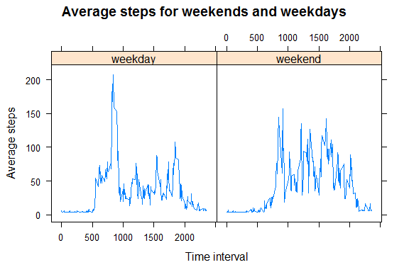

# Reproducible Research: Peer Assessment 1


## Loading and preprocessing the data

```r
setwd("C:/Users/Taaja/Desktop/R Reproducible Research/RepData_PeerAssessment1")

act <- read.csv("activity.csv")
```

What is mean total number of steps taken per day?

For this part of the assignment, you can ignore the missing values in the dataset.


#Make a histogram of the total number of steps taken each day

```r
sumperday <- aggregate(steps ~ date, data = act, sum)
hist(sumperday$steps)
```

 


#Calculate and report the mean and median total number of steps taken per day

```r
mean(sumperday$steps, na.rm = TRUE)
```

```
## [1] 10766
```

```r
median(sumperday$steps, na.rm = TRUE)
```

```
## [1] 10765
```

On average, this person stepped 1.08\times 10^{4} per day (median: 10765).

## What is the average daily activity pattern?

```r
act.NA <- act[complete.cases(act),]
av.int <- aggregate(steps ~ interval, data = act.NA, mean, na.rm=TRUE)
plot(av.int$interval, av.int$steps, type="l", xlab="Interval", ylab="Average steps")
```

 

#Which 5-minute interval, on average across all the days in the dataset, 
#contains the maximum number of steps?

```r
av.int$interval[max(av.int$steps)]
```

```
## [1] 1705
```


## Imputing missing values
#Note that there are a number of days/intervals where there are missing values (coded as NA).
#The presence of missing days may introduce bias into some calculations or summaries of the data.
#Calculate and report the total number of missing values in the dataset
#(i.e. the total number of rows with NAs)

#Devise a strategy for filling in all of the missing values in the dataset. 
#The strategy does not need to be sophisticated. For example, you could use the 
#mean/median for that day, or the mean for that 5-minute interval, etc.


#Create a new dataset that is equal to the original dataset but with the missing data filled in.

#Make a histogram of the total number of steps taken each day and Calculate 
#and report the mean and median total number of steps taken per day. 
#Do these values differ from the estimates from the first part of the assignment? 
#What is the impact of imputing missing data on the estimates of the total 
#daily number of steps?

```r
sum(is.na(act))
```

```
## [1] 2304
```

```r
library(lubridate)
act.NA$daynum <- yday(as.Date(act.NA$date))
model <- glm(steps ~ interval + daynum, data=act.NA)

missing <- act[is.na(act),]
missing$steps <- NULL
missing$daynum <- yday(as.Date(missing$date))

preds <- predict(model, missing[,2:3], se = TRUE)

missing$steps <- preds[["fit"]]

act.preds<- rbind(missing, act.NA)

sumperday.preds <- aggregate(steps ~ date, data = act.preds, sum)
hist(sumperday.preds$steps)
```

 

```r
mean(sumperday.preds$steps, na.rm = TRUE)
```

```
## [1] 10767
```

```r
median(sumperday.preds$steps, na.rm = TRUE)
```

```
## [1] 10781
```


## Are there differences in activity patterns between weekdays and weekends?
#For this part the weekdays() function may be of some help here. 
#Use the dataset with the filled-in missing values for this part.
#Create a new factor variable in the dataset with two levels -- "weekday" and "weekend" 
#indicating whether a given date is a weekday or weekend day.

#Make a panel plot containing a time series plot (i.e. type = "l") of the 5-minute 
#interval (x-axis) and the average number of steps taken, averaged across all weekday
#days or weekend days (y-axis). 


```r
act.preds$date <- as.Date(act.preds$date)
act.preds$weekday <- weekdays(act.preds$date)
act.preds$weekday.or.weekend <- ifelse(act.preds$weekday %in% c("Sunday", "Saturday"), "weekend","weekday")


av.int.pred <- aggregate(steps ~ interval + weekday.or.weekend, data = act.preds, mean, na.rm=TRUE)

library(lattice)
xyplot(steps~interval|weekday.or.weekend, data=av.int.pred, type ="l",
       main="Average steps for weekends and weekdays", 
       ylab="Average steps", xlab="Time interval")
```

 
