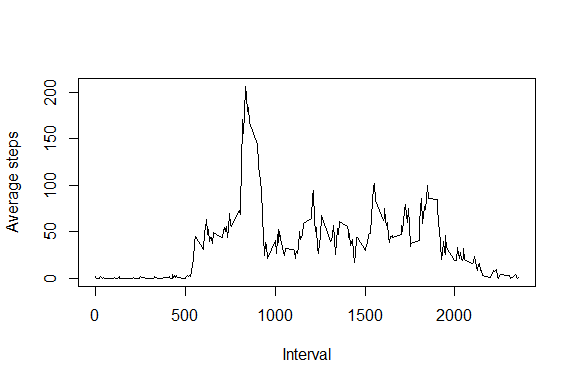

# Reproducible Research: Peer Assessment 1


### Loading and preprocessing the data

```r
setwd("C:/Users/Taaja/Desktop/R Reproducible Research/RepData_PeerAssessment1")
act <- read.csv("activity.csv")
```

Here is a histogram of the total number of steps taken each day.


```r
sumperday <- aggregate(steps ~ date, data = act, sum)
hist(sumperday$steps, xlab="Steps", main = "Histogram of the number of steps")
```

 

###Mean and median steps
On average, this person had 10766.19 steps per day (median: 10765 steps).

If you want to see the code used to calculate those numbers:

```r
#mean(sumperday$steps, na.rm = TRUE)
#median(sumperday$steps, na.rm = TRUE)
```

### What is the average daily activity pattern?

```r
act.NA <- act[complete.cases(act),]
av.int <- aggregate(steps ~ interval, data = act.NA, mean, na.rm=TRUE)
plot(av.int$interval, av.int$steps, type="l", xlab="Interval", ylab="Average steps")
```

 

Which 5-minute interval, on average across all the days in the dataset, 
contains the maximum number of steps?

The 1705 interval had the maximum number of steps. 

If you want to see the code used to calculate those numbers:

```r
#av.int$interval[max(av.int$steps)]
```

### Imputing missing values
In total, there were 2304 missing values in the dataset. I replaced the missing values with a glm model of interval and daynumber. 


```r
#r sum(is.na(act)) Find the number of missing values

library(lubridate)
act.NA$daynum <- yday(as.Date(act.NA$date))
model <- glm(steps ~ interval + daynum, data=act.NA)

missing <- act[is.na(act),]
missing$steps <- NULL
missing$daynum <- yday(as.Date(missing$date))

preds <- predict(model, missing[,2:3], se = TRUE)

missing$steps <- preds[["fit"]]

act.preds<- rbind(missing, act.NA)

sumperday.preds <- aggregate(steps ~ date, data = act.preds, sum)
```

Here is a histogram with the replaced missing values.

```r
hist(sumperday.preds$steps, xlab="Steps", main = "Histogram of the number of steps")
```

 

###Mean and median number of steps (with replacement values)
On average, this person had 10767.17 steps per day (median: 10781.1 steps).


```r
#mean(sumperday.preds$steps, na.rm = TRUE)
#median(sumperday.preds$steps, na.rm = TRUE)
```


### Are there differences in activity patterns between weekdays and weekends?
Yes! Check out this plot.


```r
act.preds$date <- as.Date(act.preds$date)
act.preds$weekday <- weekdays(act.preds$date)
act.preds$weekday.or.weekend <- ifelse(act.preds$weekday %in% c("Sunday", "Saturday"), "weekend","weekday")

av.int.pred <- aggregate(steps ~ interval + weekday.or.weekend, data = act.preds, mean, na.rm=TRUE)

library(lattice)
xyplot(steps~interval|weekday.or.weekend, data=av.int.pred, type ="l",
       main="Average steps for weekends and weekdays", 
       ylab="Average steps", xlab="Time interval")
```

 
